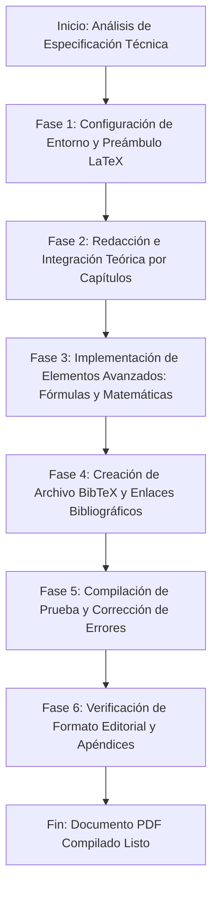

# Metadata

* **Título propuesto:** Tratado de Ciencia e Ingeniería de Polímeros: De la Estructura Molecular a la Sostenibilidad Industrial
* **Autor:** [Placeholder: Nombre del Autor / Filiación Institucional]
* **Fecha:** [Placeholder: Fecha de Publicación]
* **Tipo de documento:** Libro de Texto Académico / Monografía Avanzada de Referencia
* **Idioma:** Español
* **Nivel académico objetivo:** Estudiantes de posgrado (Maestría/Doctorado) e investigadores en Ciencia de Materiales, Ingeniería Química, Química Orgánica e Ingeniería de Polímeros.

---

# Objetivo General

Diseñar una especificación técnica exhaustiva y rigurosa que sirva de guía de arquitectura documental para la generación automática de un tratado académico sobre ciencia de polímeros en LaTeX. El documento resultante debe proporcionar un análisis profundo, riguroso y cuantitativo que conecte la estructura molecular a escala nanométrica con las propiedades macroscópicas (mecánicas, físicas, térmicas), las técnicas de procesamiento industrial, las aplicaciones de vanguardia y los desafíos ambientales actuales, estableciendo un marco conceptual y matemático sólido para cada área de estudio.

---

# Público Objetivo

Este documento está estructurado para:
1. **Estudiantes de Posgrado:** Maestría y doctorado en ingeniería de materiales, química y ramas afines que requieran una base rigurosa de las relaciones estructura-propiedad.
2. **Investigadores Académicos:** Científicos que buscan una referencia rápida y teórica de modelos matemáticos (como la teoría de Flory-Huggins o el modelo de Carothers) y tendencias de investigación.
3. **Ingenieros de Desarrollo e Industria:** Profesionales en busca de criterios cuantitativos para la selección de materiales, diseño de moldes y optimización de procesos de transformación de polímeros.

---

# Alcance

El tratado tendrá un alcance teórico-práctico avanzado. No se limitará a explicaciones cualitativas; exigirá al modelo de generación de LaTeX la inclusión de desarrollos matemáticos formales de termodinámica de soluciones, cinética de polimerización, mecánica viscoelástica y transferencia de calor en procesamiento. Abarcará todo el espectro de la ciencia de polímeros, organizándose en 16 capítulos fundamentales y garantizando una transición lógica desde los principios fundamentales microscópicos hasta las realidades industriales y ecológicas globales.

---

# Estructura General

El documento LaTeX final deberá estructurarse de la siguiente manera:

* **Páginas Preliminares**
  * Portada formal (Institucional)
  * Dedicatoria y Agradecimientos (Placeholders)
  * Resumen (Abstract en Español e Inglés)
  * Índice General (Table of Contents)
  * Índice de Figuras (List of Figures)
  * Índice de Tablas (List of Tables)
* **Cuerpo Principal**
  * **Capítulo 1:** Introducción a la Ciencia de los Polímeros
  * **Capítulo 2:** Clasificación de los Materiales Poliméricos
  * **Capítulo 3:** Estructura Molecular y Conformación de Cadenas
  * **Capítulo 4:** Métodos de Síntesis y Mecanismos de Polimerización
  * **Capítulo 5:** Propiedades Físicas y Termodinámica de Soluciones Poliméricas
  * **Capítulo 6:** Propiedades Mecánicas y Comportamiento Viscoelástico
  * **Capítulo 7:** Propiedades Térmicas y Transiciones de Fase
  * **Capítulo 8:** Procesamiento Industrial de Polímeros
  * **Capítulo 9:** Polímeros Termoplásticos de Ingeniería y de Gran Consumo
  * **Capítulo 10:** Polímeros Termoestables y Formación de Redes
  * **Capítulo 11:** Elastómeros y Teoría de la Elasticidad del Caucho
  * **Capítulo 12:** Materiales Compuestos Reforzados con Polímeros
  * **Capítulo 13:** Aplicaciones Industriales Avanzadas y de Ingeniería
  * **Capítulo 14:** Impacto Ambiental de los Materiales Poliméricos
  * **Capítulo 15:** Tecnologías de Reciclaje y Gestión de Residuos
  * **Capítulo 16:** Tendencias Actuales de Investigación y Polímeros del Futuro
* **Secciones Finales**
  * Conclusiones Generales e Integración Disciplinar
  * Referencias Bibliográficas (Estilo numérico/IEEE)
  * **Apéndice A:** Modelos Matemáticos y Deducciones Detalladas (Teoría de Flory-Huggins)
  * **Apéndice B:** Glosario de Siglas de Polímeros de Uso Comercial y Técnico

---

# Plan de Capítulos

## Capítulo 1: Introducción a la Ciencia de los Polímeros

### Objetivo
Establecer el marco histórico y las definiciones fundamentales de las macromoléculas, delimitando los conceptos de monómero, unidad repetitiva, grado de polimerización y peso molecular promedio, justificando su relevancia económica y tecnológica contemporánea.

### Temas a cubrir
* Evolución histórica del concepto de macromolécula (trabajos de Hermann Staudinger).
* Definición de polímero, monómero y oligómero.
* La unidad constitucional repetitiva frente al monómero de partida.
* Grado de polimerización ($DP$) y peso molecular.
* Distribución de pesos moleculares y polidispersidad ($M_n$, $M_w$, $M_z$).
* Importancia socioeconómica global y consumo de polímeros sintéticos en la industria.

### Conceptos clave
* Macromolécula.
* Peso molecular promedio en número ($M_n$) y peso molecular promedio en peso ($M_w$).
* Índice de polidispersidad ($PDI$ o $D$).
* Teoría macromolecular de Staudinger.

### Figuras recomendadas
* **Figura 1.1:** Esquema representativo de la polimerización que muestra la transición conceptual de monómeros individuales dispersos a una cadena lineal unida covalentemente.
* **Figura 1.2:** Gráfica de distribución de pesos moleculares indicando las posiciones relativas de $M_n$, $M_v$, $M_w$ y $M_z$.

### Tablas recomendadas
* **Tabla 1.1:** Comparativa de escalas dimensionales y pesos moleculares entre compuestos de bajo peso molecular, oligómeros y polímeros de alto peso molecular.

### Ecuaciones recomendadas
* Ecuación del peso molecular promedio en número:
  $$M_n = \frac{\sum N_i M_i}{\sum N_i}$$
* Ecuación del peso molecular promedio en peso:
  $$M_w = \frac{\sum N_i M_i^2}{\sum N_i M_i}$$
* Índice de polidispersidad:
  $$\text{\DJ} = \frac{M_w}{M_n}$$

### Nivel de profundidad
Intermedio. Explicativo con derivación algebraica básica de pesos moleculares estadísticos.

### Dependencias con otros capítulos
Requisito fundamental para todos los capítulos subsiguientes, especialmente para el Capítulo 3 (Estructura molecular) y el Capítulo 4 (Síntesis).

---

## Capítulo 2: Clasificación de los Materiales Poliméricos

### Objetivo
Proporcionar un sistema de clasificación multidimensional de los polímeros basado en criterios de origen, arquitectura macromolecular, comportamiento térmico, mecanismo de síntesis y aplicaciones, facilitando una taxonomía lógica de los materiales.

### Temas a cubrir
* Clasificación según su origen: naturales, sintéticos y semisintéticos.
* Clasificación según su comportamiento térmico-mecánico: termoplásticos, termoestables y elastómeros.
* Clasificación según la estructura de la cadena: lineales, ramificados, reticulados y dendrímeros.
* Clasificación según la composición de la cadena: homopolímeros y copolímeros (estadísticos, alternantes, en bloque y de injerto).
* Clasificación según el mecanismo de formación: polímeros de adición y de condensación (criterio clásico de Carothers vs. Flory).

### Conceptos clave
* Termoplástico y Termoestable.
* Homopolímero y Copolímero.
* Homocadena y Heterocadena.
* Dendrímeros e Híper-ramificados.

### Figuras recomendadas
* **Figura 2.1:** Diagrama esquemático tridimensional de las diferentes arquitecturas de cadena: lineal, ramificada, reticulada y dendrimérica.
* **Figura 2.2:** Representación de tipos de copolímeros: al azar, alternante, en bloque y de injerto.

### Tablas recomendadas
* **Tabla 2.1:** Tabla comparativa matriz que cruce el tipo de polímero (termoplástico, termoestable, elastómero) frente a sus características estructurales, fusibilidad, solubilidad y reciclabilidad.

### Ecuaciones recomendadas
* Ecuación de composición de copolímeros en función del grado de conversión y razones de reactividad (Ecuación de Mayo-Lewis):
  $$F_1 = \frac{r_1 f_1^2 + f_1 f_2}{r_1 f_1^2 + 2 f_1 f_2 + r_2 f_2^2}$$

### Nivel de profundidad
Descriptivo avanzado. Requiere taxonomía analítica clara y rigurosa.

### Dependencias con otros capítulos
Conecta directamente con el Capítulo 9 (Termoplásticos), Capítulo 10 (Termoestables) y Capítulo 11 (Elastómeros).

---

## Capítulo 3: Estructura Molecular y Conformación de Cadenas

### Objetivo
Analizar la microestructura de los polímeros a nivel atómico y de enlace, cubriendo la estereorregularidad (tacticidad), isomería, fuerzas intermoleculares, y el modelado matemático de la conformación de cadenas en disolución.

### Temas a cubrir
* Configuración vs. Conformación en macromoléculas.
* Estereorregularidad y Tacticidad: polímeros isotácticos, sindiotácticos y atácticos. Importancia de la catálisis Ziegler-Natta.
* Isomería geométrica en polímeros diénicos (cis y trans 1,4-polibutadieno).
* Enlaces químicos: enlaces covalentes en la cadena principal y fuerzas intermoleculares secundarias (enlaces de hidrógeno, fuerzas dipolo-dipolo, fuerzas de dispersión de London).
* Conformación de cadenas: modelo de enlace libremente unido (caminata aleatoria), modelo de rotación libre y modelo de rotación restringida. Concepto de longitud de enlace efectiva y relación de característica de Flory ($C_\infty$).

### Conceptos clave
* Tacticidad.
* Relación de Flory ($C_\infty$).
* Distancia extremo a extremo cuadrática media ($\langle r^2 \rangle$).
* Isomería geométrica.

### Figuras recomendadas
* **Figura 3.1:** Representación en proyección tridimensional de Fischer y de cuñas de cadenas de polipropileno isotáctico, sindiotáctico y atáctico.
* **Figura 3.2:** Modelo físico del ovillo aleatorio (random coil) indicando el vector extremo a extremo $\vec{r}$.

### Tablas recomendadas
* **Tabla 3.1:** Valores típicos de la relación de característica de Flory ($C_\infty$) para diversos polímeros lineales y su correlación con la rigidez de cadena.

### Ecuaciones recomendadas
* Distancia extremo a extremo cuadrática media para una cadena libremente unida:
  $$\langle r^2 \rangle_0 = n l^2$$
* Distancia para una cadena con rotación restringida por ángulo de enlace ($\theta$):
  $$\langle r^2 \rangle_{free} = n l^2 \left( \frac{1 - \cos\theta}{1 + \cos\theta} \right)$$
* Relación de característica de Flory:
  $$C_\infty = \lim_{n \to \infty} \frac{\langle r^2 \rangle_0}{n l^2}$$

### Nivel de profundidad
Altamente teórico y matemático. Modelado estadístico de polímeros.

### Dependencias con otros capítulos
Esencial para comprender el Capítulo 5 (Propiedades físicas) y el Capítulo 11 (Elastómeros - entropía del caucho).

---

## Capítulo 4: Métodos de Síntesis y Mecanismos de Polimerización

### Objetivo
Describir detalladamente los mecanismos químicos de polimerización, analizando la cinética de la reacción y la termodinámica de los diferentes métodos de obtención a escala de laboratorio e industrial.

### Temas a cubrir
* Polimerización por pasos (condensación): mecanismo de reacción, ecuación de Carothers, distribución de peso molecular y control de peso molecular por exceso de reactivo.
* Polimerización en cadena (adición):
  * Radicalaria: iniciación (térmica, fotoquímica), propagación, terminación (combinación y desproporción), transferencia de cadena y cinética de estado estacionario.
  * Iónica: polimerización aniónica viviente (síntesis de copolímeros en bloque controlados) y catiónica.
  * Coordinativa: catalizadores Ziegler-Natta y metalocenos.
* Polimerización controlada/pseudoviviente (ATRP, RAFT, NMP).
* Procesos de polimerización industrial: en masa, en disolución, en suspensión y en emulsión.

### Conceptos clave
* Ecuación de Carothers y Grado de conversión ($p$).
* Polimerización aniónica viviente.
* Transferencia de cadena.
* Polimerización en emulsión (micelas y cinéticas locales).

### Figuras recomendadas
* **Figura 4.1:** Curvas del grado de polimerización promedio en número en función de la conversión ($p$) para comparar polimerización por pasos (crecimiento muy lento a bajas conversiones) y polimerización en cadena (peso molecular alto desde el inicio).
* **Figura 4.2:** Esquema del mecanismo y fases de la polimerización en emulsión, detallando el papel del surfactante, las gotas de monómero y las micelas.

### Tablas recomendadas
* **Tabla 4.1:** Cuadro comparativo de los métodos de procesamiento de polimerización (masa, solución, suspensión, emulsión) considerando ventajas, desventajas, pureza del polímero y control térmico del reactor.

### Ecuaciones recomendadas
* Ecuación de Carothers para sistemas estequiométricos:
  $$\bar{X}_n = \frac{1}{1-p}$$
* Velocidad global de polimerización radicalaria:
  $$R_p = k_p [M] \left( \frac{f k_d [I]}{k_t} \right)^{1/2}$$
* Grado de polimerización cinético inicial sin transferencia de cadena:
  $$\nu = \frac{R_p}{R_t} = \frac{k_p [M]}{2 (f k_d k_t [I])^{1/2}}$$

### Nivel de profundidad
Químico y cinético avanzado. Ecuaciones cinéticas diferenciales rigurosas.

### Dependencias con otros capítulos
Es la base química de la producción de materiales. Conecta con el Capítulo 8 (Procesamiento industrial) y Capítulo 10 (Termoestables).

---

## Capítulo 5: Propiedades Físicas y Termodinámica de Soluciones Poliméricas

### Objetivo
Estudiar la termodinámica del mezclado de polímeros y solventes, deduciendo el modelo de red de Flory-Huggins y analizando las propiedades físicas resultantes como la viscosidad intrínseca y la presión osmótica.

### Temas a cubrir
* Termodinámica del mezclado de polímeros: entropía de mezcla anormalmente baja debido al tamaño macromolecular.
* Teoría de red de Flory-Huggins: deducción de la energía libre de mezcla y el parámetro de interacción de Flory-Huggins ($\chi_1$).
* Criterio de solubilidad: parámetro de solubilidad de Hildebrand y Hansen.
* Comportamiento en disolución: soluciones diluidas, semidiluidas y concentradas. Transiciones de fase de solución (temperaturas críticas de disolución superior UCST e inferior LCST).
* Determinación experimental del peso molecular: osmometría de membrana (presión osmótica y segundo coeficiente del virial), viscosimetría de soluciones diluidas (ecuación de Mark-Houwink-Sakurada) y cromatografía de exclusión molecular (SEC/GPC).

### Conceptos clave
* Teoría de Flory-Huggins.
* Parámetro de interacción ($\chi_1$).
* Viscosidad intrínseca ($[\eta]$).
* GPC (Gel Permeation Chromatography).

### Figuras recomendadas
* **Figura 5.1:** Diagrama de fases temperatura vs. fracción en volumen de polímero que ilustra la región espinodal, binodal, y los puntos críticos UCST y LCST.
* **Figura 5.2:** Esquema de funcionamiento de un equipo de GPC/SEC y curva de calibración universal utilizando estándares monodispersos.

### Tablas recomendadas
* **Tabla 5.1:** Parámetros de solubilidad de Hildebrand ($\delta$) para solventes industriales comunes y polímeros comerciales de gran volumen.

### Ecuaciones recomendadas
* Energía libre de mezcla de Flory-Huggins:
  $$\Delta G_m = R T \left[ n_1 \ln \phi_1 + n_2 \ln \phi_2 + \chi_{12} n_1 \phi_2 \right]$$
* Ecuación de Mark-Houwink-Sakurada:
  $$[\eta] = K M_v^a$$
* Relación presión osmótica (desarrollo del virial):
  $$\frac{\Pi}{c} = R T \left( \frac{1}{M_n} + A_2 c + A_3 c^2 + \dots \right)$$

### Nivel de profundidad
Altamente avanzado. Termodinámica estadística rigurosa.

### Dependencias con otros capítulos
Muy conectado con el Capítulo 3 (Conformación) y fundamental para la caracterización analítica descrita en otros capítulos.

---

## Capítulo 6: Propiedades Mecánicas y Comportamiento Viscoelástico

### Objetivo
Describir el comportamiento mecánico de los polímeros frente a fuerzas aplicadas, combinando la elasticidad de los sólidos y la viscosidad de los líquidos en modelos matemáticos viscoelásticos lineales y dinámicos.

### Temas a cubrir
* Comportamiento mecánico bajo carga: tracción, compresión, flexión y cizallamiento. Curva esfuerzo-deformación.
* Transición de dúctil a frágil en polímeros.
* Fenómeno de fluencia (creep) y relajación de esfuerzos.
* Concepto de viscoelasticidad lineal:
  * Modelo mecánico de Maxwell (resorte y amortiguador en serie).
  * Modelo mecánico de Kelvin-Voigt (resorte y amortiguador en paralelo).
* Principio de superposición de Boltzmann y Teoría de Viscoelasticidad Lineal General.
* Análisis Mecánico Dinámico (DMA): módulo de almacenamiento ($E'$), módulo de pérdida ($E''$) y factor de pérdida ($\tan \delta$).
* Principio de superposición tiempo-temperatura (Ecuación WLF).

### Conceptos clave
* Módulo elástico ($E$) y Módulo de corte ($G$).
* Viscoelasticidad y Relajación.
* Factor de amortiguación ($\tan \delta$).
* Tiempo de relajación ($\tau$).

### Figuras recomendadas
* **Figura 6.1:** Curvas de esfuerzo-deformación de tracción típicas que muestran la diferencia entre un polímero frágil duro, un polímero dúctil con punto de fluencia, y un elastómero altamente elástico.
* **Figura 6.2:** Representaciones esquemáticas de los modelos mecánicos analógicos de Maxwell y Kelvin-Voigt, con sus respectivas respuestas gráficas a la deformación instantánea y esfuerzo constante.
* **Figura 6.3:** Perfil típico de un ensayo de DMA mostrando $E'$, $E''$ y $\tan \delta$ a través de la temperatura de transición vítrea ($T_g$).

### Tablas recomendadas
* **Tabla 6.1:** Propiedades mecánicas mecánicas típicas de polímeros representativos (Módulo de Young, resistencia a la tracción, deformación a la rotura y resistencia al impacto).

### Ecuaciones recomendadas
* Ecuación diferencial del modelo de Maxwell:
  $$\frac{d\epsilon}{dt} = \frac{1}{E} \frac{d\sigma}{dt} + \frac{\sigma}{\eta}$$
* Respuesta a la relajación de esfuerzos del modelo de Maxwell ($\epsilon = \epsilon_0$):
  $$\sigma(t) = E \epsilon_0 e^{-t/\tau} \quad \text{donde} \quad \tau = \frac{\eta}{E}$$
* Ecuación diferencial de Kelvin-Voigt:
  $$\sigma = E\epsilon + \eta \frac{d\epsilon}{dt}$$
* Ecuación de Williams-Landel-Ferry (WLF):
  $$\log a_T = \frac{-C_1(T - T_0)}{C_2 + (T - T_0)}$$

### Nivel de profundidad
Matemático e ingenieril avanzado. Modelado reológico clásico y reología dinámica.

### Dependencias con otros capítulos
Se apoya en la conformación molecular (Capítulo 3) y es vital para el diseño estructural con plásticos (Capítulo 13).

---

## Capítulo 7: Propiedades Térmicas y Transiciones de Fase

### Objetivo
Analizar los fenómenos de transición térmica en polímeros, centrándose en los fundamentos termodinámicos y moleculares de la transición vítrea y la fusión cristalina, y las técnicas experimentales para su caracterización.

### Temas a cubrir
* Estados físicos en polímeros: amorfo, semicristalino y cristalino. Grado de cristalinidad.
* Morfología cristalina: esferulitas, lamelas y teoría del plegamiento de cadenas.
* Cinética de cristalización: Modelo cinético de Avrami.
* La transición vítrea ($T_g$): teorías termodinámicas y cinéticas (teoría del volumen libre). Factores estructurales y moleculares que controlan $T_g$.
* La transición de fusión cristalina ($T_m$). Factores de control.
* Técnicas de caracterización térmica: Calorimetría Diferencial de Barrido (DSC), Análisis Termogravimétrico (TGA) y Análisis Termomecánico (TMA).

### Conceptos clave
* Temperatura de transición vítrea ($T_g$).
* Temperatura de fusión ($T_m$).
* Ecuación de Avrami y Volumen libre.
* Cristalinidad y Esferulitas.

### Figuras recomendadas
* **Figura 7.1:** Representación del volumen específico frente a la temperatura para un polímero completamente amorfo y uno semicristalino, ilustrando el cambio de pendiente en $T_g$ y la discontinuidad de primer orden en $T_m$.
* **Figura 7.2:** Diagrama esquemático de un termograma DSC representativo que destaca la transición vítrea (cambio endotérmico de línea base), la cristalización fría (pico exotérmico) y la fusión (pico endotérmico).

### Tablas recomendadas
* **Tabla 7.1:** Lista sistemática de valores de $T_g$ y $T_m$ para polímeros de ingeniería comunes, analizando el efecto de la rigidez de la cadena y las fuerzas polares intermoleculares.

### Ecuaciones recomendadas
* Ecuación de cristalización de Avrami:
  $$1 - X_t = \exp(-k t^n)$$
* Ecuación de Fox para la $T_g$ de copolímeros y mezclas:
  $$\frac{1}{T_g} = \frac{w_1}{T_{g,1}} + \frac{w_2}{T_{g,2}}$$
* Ecuación de Flory para el descenso del punto de fusión por impurezas o copolimerización:
  $$\frac{1}{T_m} - \frac{1}{T_m^0} = -\frac{R}{\Delta H_f} \ln X_A$$

### Nivel de profundidad
Avanzado. Análisis molecular de la dinámica segmental y termodinámica de transiciones de primer y segundo orden.

### Dependencias con otros capítulos
Fundamental para determinar las ventanas de procesamiento del Capítulo 8 y las limitaciones de las aplicaciones (Capítulo 9 y 13).

---

## Capítulo 8: Procesamiento Industrial de Polímeros

### Objetivo
Estudiar los procesos industriales mediante los cuales las resinas poliméricas se transforman en productos semiacabados y acabados comerciales, analizando la física del flujo del fundido polimérico (reología del procesado).

### Temas a cubrir
* Fundamentos reológicos del fundido: comportamiento no newtoniano (pseudoplasticidad), flujo de cizalla y viscosidad extensional.
* El extrusor de un solo tornillo y de doble tornillo: zonas del extrusor (alimentación, compresión, dosificación) y balance de arrastre-presión.
* Moldeo por inyección: ciclo de inyección, diseño de moldes, canales de alimentación y defectos comunes (líneas de soldadura, rechupes, alabeo).
* Moldeo por soplado (soplado de cuerpos huecos y extrusión-soplado).
* Termoconformado y Calandrado.
* Hilado de fibras poliméricas (hilado en fundido, en húmedo y en seco).

### Conceptos clave
* Pseudoplasticidad (dilatamiento por cizalla).
* Extrusión y Moldeo por Inyección.
* Defectos de moldeo.
* Viscosidad de cizalla del fundido.

### Figuras recomendadas
* **Figura 8.1:** Diagrama esquemático detallado en corte lateral de una máquina extrusora de tornillo simple, indicando la tolva, el barril calefactor, el tornillo (con sus tres zonas funcionales), y el dado de extrusión.
* **Figura 8.2:** Curva reológica típica de viscosidad frente a velocidad de cizallamiento para un fundido de polímero, identificando la meseta newtoniana a bajas cizallas y la región de adelgazamiento por cizallamiento (ley de potencia).

### Tablas recomendadas
* **Tabla 8.1:** Resumen de los parámetros de operación típicos de procesamiento de polímeros (rango de temperatura, presiones de inyección, velocidades de deformación típicas) para polietileno, polipropileno, poliestireno y PET.

### Ecuaciones recomendadas
* Ley de potencia para fluidos no newtonianos (modelo de Ostwald-de Waele):
  $$\tau = m \dot{\gamma}^n$$
* Viscosidad aparente:
  $$\eta_a = m \dot{\gamma}^{n-1}$$
* Ecuación del flujo neto en un extrusor (modelo simplificado):
  $$Q = Q_d - Q_p = \alpha N - \frac{\beta}{\eta} \Delta P$$

### Nivel de profundidad
Físico-tecnológico e ingenieril. Con énfasis en transporte de momento y calor.

### Dependencias con otros capítulos
Vinculado con las propiedades de flujo (Capítulo 5), viscoelasticidad (Capítulo 6) y térmicas (Capítulo 7).

---

## Capítulo 9: Polímeros Termoplásticos de Ingeniería y de Gran Consumo

### Objetivo
Estudiar de forma exhaustiva las resinas termoplásticas más importantes de la industria moderna, clasificándolas entre polímeros comerciales (commodities) y plásticos de ingeniería avanzados, relacionando su estructura íntima con sus campos de aplicación particulares.

### Temas a cubrir
* Termoplásticos de Gran Consumo (Commodities):
  * Poliolefinas: Polietileno (HDPE, LDPE, LLDPE) y Polipropileno (PP). Relación entre ramificación, cristalinidad y densidad.
  * Polímeros vinílicos: Policloruro de vinilo (PVC) y el papel crucial de los plastificantes; Poliestireno (PS, HIPS, EPS).
* Termoplásticos de Ingeniería:
  * Poliamidas (Nailon 6, Nailon 6,6): enlaces de hidrógeno y alta resistencia.
  * Poliésteres: Polietilén tereftalato (PET) y Polibutilén tereftalato (PBT).
  * Policarbonato (PC): transparencia e increíble resistencia al impacto.
  * Polióxidos (POM) y Fluoropolímeros (PTFE).
* Polímeros de Alto Rendimiento: Poliéter éter cetona (PEEK), Sulfuro de polifenileno (PPS) y Poliamidas aromáticas (Aramidas/Kevlar).

### Conceptos clave
* HDPE, LDPE y LLDPE.
* Plastificación del PVC.
* Polímeros de alta temperatura (High-Performance Polymers).
* Poliamidas aromáticas.

### Figuras recomendadas
* **Figura 9.1:** Esquema comparativo de la estructura ramificada molecular del HDPE (lineal puro), LLDPE (ramificaciones cortas controladas) y LDPE (ramificaciones largas y desordenadas).
* **Figura 9.2:** Fórmula de estructura química de polímeros de ingeniería avanzados (PEEK, PC y Kevlar) destacando la presencia de anillos aromáticos y grupos funcionales rígidos que confieren estabilidad térmica.

### Tablas recomendadas
* **Tabla 9.1:** Gran matriz de comparación física de los termoplásticos tratados, que incluya: Densidad, Temperatura de uso continuo máxima, Resistencia mecánica a la tracción, Transparencia óptica, y Principales sectores de aplicación comercial.

### Ecuaciones recomendadas
* Expresión simplificada de la cristalinidad a partir del calor de fusión de DSC:
  $$X_c (\%) = \frac{\Delta H_f}{\Delta H_f^0} \times 100$$

### Nivel de profundidad
Detallado e industrial. Centrado en la relación estructura-propiedades-aplicación específica de cada familia química.

### Dependencias con otros capítulos
Basado en los Capítulos 2, 3, 6 y 7. Es la aplicación directa de los conceptos de termoplasticidad de dichos capítulos.

---

## Capítulo 10: Polímeros Termoestables y Formación de Redes

### Objetivo
Analizar la química y la física de la reticulación de polímeros termoestables, describiendo el proceso de curado, la gelificación (punto de gel) y las propiedades resultantes de las redes poliméricas tridimensionales estables.

### Temas a cubrir
* Definición estructural y diferencias fundamentales con los termoplásticos.
* Principales familias de termoestables:
  * Resinas Epoxi: química del anillo oxirano y agentes de curado (aminas, anhídridos).
  * Resinas de Poliéster Insaturado: curado por copolimerización radicalaria cruzada con estireno.
  * Resinas Fenol-Formaldehído (Baquelita, novolacas y resoles) y Resinas de Poliuretano (química de isocianatos y polioles).
* Termodinámica del proceso de curado:
  * El concepto de gelificación (punto de gel) e insolubilidad.
  * Vitrificación durante el curado. Diagrama TTT (Tiempo-Temperatura-Transformación).
* Caracterización del curado: reometría oscilatoria, DSC térmico y espectroscopia FTIR.

### Conceptos clave
* Punto de gel (Gelación).
* Resinas Epoxídicas.
* Red tridimensional (Cross-linking).
* Diagrama TTT de curado.

### Figuras recomendadas
* **Figura 10.1:** Esquema bidimensional tridimensional que ilustra la progresión del curado termoestable: mezcla de monómeros multifuncionales $\rightarrow$ crecimiento molecular y ramificación $\rightarrow$ gelificación (aparición de la primera molécula infinita insoluble) $\rightarrow$ red totalmente reticulada.
* **Figura 10.2:** Gráfica del Diagrama TTT (Tiempo-Temperatura-Transformación) que muestra los estados de líquido, gel, caucho, vidrio y las curvas de gelificación y vitrificación.

### Tablas recomendadas
* **Tabla 10.1:** Resumen de las reacciones típicas de curado de termoestables, indicando las estructuras de los monómeros reactivos y los grupos químicos de enlace resultantes de la red.

### Ecuaciones recomendadas
* Ecuación estadística de Flory-Stockmayer para el punto de gel de sistemas multifuncionales homólogos:
  $$p_c = \frac{1}{f - 1}$$
* Ecuación generalizada para sistemas reactivos heterogéneos con estequiometría balanceada y funcionalidad promedio $f_{avg}$:
  $$p_c = \frac{1}{\sqrt{r (f_A - 1)(f_B - 1)}}$$

### Nivel de profundidad
Teórico-práctico riguroso. Modelos matemáticos de la gelificación y cinética de curado epóxico.

### Dependencias con otros capítulos
Basado en los Capítulos 2 y 4 (síntesis multifuncional). Requisito indispensable para comprender el Capítulo 12 (Compuestos reforzados).

---

## Capítulo 11: Elastómeros y Teoría de la Elasticidad del Caucho

### Objetivo
Estudiar las bases moleculares de la elasticidad de los elastómeros y vulcanizados, fundamentando la capacidad de deformaciones reversibles gigantes en termodinámica estadística y deduciendo la ecuación constitutiva del caucho ideal.

### Temas a cubrir
* Características estructurales de los elastómeros: cadenas flexibles con baja $T_g$ y baja densidad de reticulación.
* Química de la vulcanización: vulcanización con azufre de cauchos diénicos (mecanismo clásico de Charles Goodyear) y vulcanización libre de azufre (peróxidos).
* Elastómeros comerciales principales: Caucho Natural (cis-poliisopreno), Caucho Estireno-Butadieno (SBR), Neopreno (policloropreno), Caucho Nitrilo (NBR), Siliconas (polidimetilsiloxano) y Elastómeros Termoplásticos (TPEs, e.g., copolímeros tribloque SBS).
* Fundamentos termodinámicos de la elasticidad del caucho: fuerza impulsada por entropía frente a energía interna. La paradoja térmica del caucho (calentamiento bajo tracción).
* Teoría estadística de la elasticidad del caucho: modelo de red afín y cálculo del cambio de entropía de deformación. Ecuación de estado del caucho elástico.

### Conceptos clave
* Vulcanización.
* Entropía y Elasticidad del caucho.
* Elastómeros termoplásticos (TPE).
* Relación de deformación ($\lambda = l / l_0$).

### Figuras recomendadas
* **Figura 11.1:** Esquema molecular que explica el origen entrópico de la elasticidad del caucho: cadenas en estado de reposo (máximo desorden entrópico, ovillos aleatorios) frente a cadenas sometidas a tracción (cadenas extendidas y alineadas, ordenadas y de baja entropía).
* **Figura 11.2:** Gráfica comparativa de la curva teórica de tracción de la ecuación estadística del caucho ideal frente a los datos reales de tracción experimental del caucho natural vulcanizado, mostrando la desviación por cristalización inducida por deformación a altas extensiones.

### Tablas recomendadas
* **Tabla 11.1:** Comparativa de rendimiento y propiedades químicas (resistencia al aceite, resistencia a la temperatura, permeabilidad a gases y costos) de elastómeros sintéticos y naturales comunes.

### Ecuaciones recomendadas
* Relación termodinámica de la fuerza elástica tensora ($f$):
  $$f = \left( \frac{\partial U}{\partial l} \right)_{T, V} - T \left( \frac{\partial S}{\partial l} \right)_{T, V}$$
* Fuerza por unidad de área inicial en función de la relación de deformación ($\lambda$):
  $$\sigma_0 = \frac{f}{A_0} = N k_B T \left( \lambda - \frac{1}{\lambda^2} \right)$$
* Módulo de corte elástico de una red de caucho vulcanizado:
  $$G = N k_B T = \frac{\rho R T}{M_c}$$

### Nivel de profundidad
Físico y termodinámico altamente avanzado. Exige deducción estadística rigurosa.

### Dependencias con otros capítulos
Basado estrechamente en el Capítulo 3 (Conformación estadística de cadenas) y Capítulo 6 (Mecánica general).

---

## Capítulo 12: Materiales Compuestos Reforzados con Polímeros

### Objetivo
Analizar la física e ingeniería de los materiales compuestos multifásicos en los que una matriz polimérica se refuerza con fibras de alto rendimiento u otras cargas estructuradas, deduciendo propiedades mecánicas conjuntas complejas.

### Temas a cubrir
* Clasificación de materiales compuestos basados en polímeros: reforzados con partículas, reforzados con fibras estructurales (cortas, largas, continuas, tejidos).
* Tipos de matriz: matrices termoplásticas vs. termoestables (epóxicas, poliéster).
* Tipos de refuerzo: fibra de vidrio (E-glass, S-glass), fibra de carbono (PAN-based, pitch-based) y fibras de aramida (Kevlar).
* Interfase matriz-refuerzo: agentes de acoplamiento (silanos), mojabilidad de la fibra e importancia del esfuerzo cortante interfacial.
* Micromecánica de compuestos de fibra continua alineada:
  * Modelo de Voigt (isodeformación): estimación del módulo longitudinal ($E_L$).
  * Modelo de Reuss (isoesfuerzo): estimación del módulo transversal ($E_T$).
* Procesos de fabricación de compuestos: laminado manual (hand lay-up), infusión de resina al vacío (VARTM), bobinado de filamento (filament winding), pultrusión, moldeo por transferencia de resina (RTM) y preimpregnados (prepregs).

### Conceptos clave
* Matriz polimérica y Refuerzo.
* Materiales compuestos reforzados con fibra de carbono (CFRP) y de vidrio (GFRP).
* Ley de mezclas mecánicas.
* Adhesión interfacial.

### Figuras recomendadas
* **Figura 12.1:** Esquema tridimensional de un material compuesto unidireccional de fibra continua, ilustrando las direcciones principales de carga ($1$ longitudinal, y $2, 3$ transversales) y el plano interfacial de transferencia de carga.
* **Figura 12.2:** Flujograma técnico de producción industrial comparativo entre el proceso de pultrusión continua y el método de moldeo por transferencia de resina (RTM).

### Tablas recomendadas
* **Tabla 12.1:** Comparación de propiedades mecánicas específicas (Módulo de tracción, resistencia última a la tracción y densidad) de fibras de refuerzo individuales frente a metales estructurales comunes (acero, aluminio).

### Ecuaciones recomendadas
* Módulo longitudinal de un compuesto unidireccional (Regla de mezclas - Modelo de Voigt):
  $$E_L = E_f V_f + E_m V_m$$
* Módulo transversal de un compuesto unidireccional (Modelo de Reuss):
  $$E_T = \frac{E_f E_m}{E_f V_m + E_m V_f}$$
* Esfuerzo de tracción último longitudinal:
  $$\sigma_{c}^* = \sigma_{f}^* V_f + \sigma_{m}' (1 - V_f)$$

### Nivel de profundidad
Físico-mecánico avanzado. Mecánica de medios continuos anisotrópicos aplicados.

### Dependencias con otros capítulos
Basado directamente en los Capítulos 6 (Propiedades mecánicas), 9 (Termoplásticos), y 10 (Termoestables).

---

## Capítulo 13: Aplicaciones Industriales Avanzadas y de Ingeniería

### Objetivo
Examinar los campos de aplicación tecnológicos de vanguardia de los polímeros funcionales y de ingeniería, ilustrando el reemplazo estratégico de metales en sectores industriales clave como la industria aeroespacial, automotriz, médica y electrónica.

### Temas a cubrir
* Reemplazo de metales en el sector automotriz y de transporte: reducción de peso para eficiencia de combustible y vehículos eléctricos. Piezas bajo el capó y estructurales.
* Industria aeroespacial: fuselajes de aviones comerciales modernos (e.g., Boeing 787, Airbus A350) fabricados con compuestos poliméricos de fibra de carbono.
* Polímeros en aplicaciones biomédicas: implantes biocompatibles (PEEK grado médico), suturas reabsorbibles (poli(ácido láctico-co-glicólico) PLGA), andamios para ingeniería de tejidos y sistemas de liberación controlada de fármacos.
* Polímeros funcionales e inteligentes: polímeros conductores intrínsecos (polianilina, PEDOT:PSS), polímeros con memoria de forma (SMPs), hidrogeles inteligentes sensibles al estímulo (pH, temperatura) y polímeros piezoeléctricos (PVDF).
* Aplicaciones en empaques avanzados: películas barrera multicapa (EVOH, PVDC) para conservación de alimentos.

### Conceptos clave
* Reducción de masa (Lightweighting).
* Implantes biocompatibles.
* Polímeros conductores e inteligentes.
* Películas barrera de gas.

### Figuras recomendadas
* **Figura 13.1:** Diagrama anatómico de un avión comercial contemporáneo que indica la distribución porcentual de los materiales de construcción utilizados, destacando el rol mayoritario de los plásticos reforzados con fibra de carbono (CFRP).
* **Figura 13.2:** Esquema que explica el principio de conductividad eléctrica en un polímero conductor conjugado (e.g., poliacetileno dopado), mostrando los enlaces simples-dobles alternados y la movilidad de polarones y bipolarones.

### Tablas recomendadas
* **Tabla 13.1:** Matriz de polímeros utilizados en medicina, especificando el nombre químico del polímero, su biocompatibilidad o bioabsorbibilidad, la vida media útil in vivo esperada, y su aplicación clínica principal.

### Ecuaciones recomendadas
* Ecuación simplificada del flujo difusivo de gas a través de una barrera polimérica (Ley de Fick):
  $$J = - P_m \frac{\Delta p}{L}$$
  donde $P_m = D \cdot S$ ($D$: coeficiente de difusión, $S$: coeficiente de solubilidad).

### Nivel de profundidad
Descriptivo avanzado y aplicado. Enfoque multidisciplinario que une ciencia de materiales con ingeniería de diseño.

### Dependencias con otros capítulos
Basado en los Capítulos 6, 7, 9, 10 y 12. Demuestra la utilidad de todo el conocimiento teórico-técnico desarrollado previamente.

---

## Capítulo 14: Impacto Ambiental de los Materiales Poliméricos

### Objetivo
Evaluar críticamente la problemática ecológica ligada al uso intensivo de polímeros sintéticos, analizando su persistencia ambiental, la generación de microplásticos, la huella de carbono de su producción y el estado de los biopolímeros biodegradables alternativos.

### Temas a cubrir
* Acumulación global de plásticos en ecosistemas terrestres y marinos.
* Persistencia y resistencia al biodeterioro: factores químicos que limitan la biodegradación en polímeros basados en carbono sintéticos tradicionales.
* El problema de los microplásticos y nanoplásticos: formación por fragmentación abiótica y su ecotoxicidad en la cadena alimentaria marina y humana.
* Huella de carbono y análisis del ciclo de vida (LCA) simplificado de plásticos derivados del petróleo vs. plásticos alternativos.
* Polímeros Biodegradables y Bioplásticos:
  * Definición diferencial: base bio (fuente renovable) vs. biodegradable (fin de vida útil ecológico).
  * Principales polímeros biodegradables comerciales: Poli(ácido láctico) (PLA), Polihidroxialcanoatos (PHAs), Poli(butilén adipato-co-tereftalato) (PBAT) y termoplásticos basados en almidón.
  * Mecanismos químicos y biológicos de la biodegradación en compostaje industrial y en ambientes marinos.

### Conceptos clave
* Microplásticos primarios y secundarios.
* Bioplásticos vs. Polímeros Biodegradables.
* Polilactida (PLA) y Polihidroxibutirato (PHB).
* Biodegradación enzimática e hidrolítica.

### Figuras recomendadas
* **Figura 14.1:** Cuadrante conceptual de los plásticos de dos ejes: Origen (Petroquímico vs. Bio-basado) frente a Biodegradabilidad (No Biodegradable vs. Biodegradable), ubicando ejemplos reales (e.g., bio-PE en el cuadrante bio-basado/no biodegradable, PLA en bio-basado/biodegradable).
* **Figura 14.2:** Esquema del ciclo biogeoquímico y degradativo del PLA desde la fotosíntesis del cultivo de origen (maíz/caña), procesamiento, uso, compostaje microbiano y conversión final a $CO_2$ y agua.

### Tablas recomendadas
* **Tabla 14.1:** Comparación de estándares internacionales de certificación de biodegradabilidad y compostabilidad (e.g., EN 13432, ASTM D6400) detallando los tiempos exigidos y condiciones requeridas de temperatura y humedad.

### Ecuaciones recomendadas
* Reacción generalizada de hidrólisis ácida o básica de poliésteres sintéticos:
  $$\sim R_1 - COO - R_2 \sim + H_2O \rightarrow \sim R_1 - COOH + OH - R_2 \sim$$

### Nivel de profundidad
Científico e integrador. Aborda el tema con ecotoxicología objetiva y química verde avanzada.

### Dependencias con otros capítulos
Directamente relacionado con las aplicaciones de empaque (Capítulo 13) y es el preámbulo lógico para el Capítulo 15 (Reciclaje).

---

## Capítulo 15: Tecnologías de Reciclaje y Gestión de Residuos

### Objetivo
Estudiar las tecnologías e ingenierías aplicadas a la gestión y valorización de los residuos plásticos de posconsumo, analizando las ventajas, limitaciones técnicas y cinéticas químicas de los diferentes niveles de reciclaje.

### Temas a cubrir
* Jerarquía de gestión de residuos de polímeros.
* Reciclaje Mecánico (Primario y Secundario):
  * Etapas: recolección, clasificación (espectroscopia infrarroja cercana NIR), trituración, lavado y extrusión.
  * Degradación térmica, oxidativa y mecánica durante el reciclaje mecánico: disminución del peso molecular y pérdida de propiedades físicas.
  * Problema de la mezcla e incompatibilidad termodinámica de polímeros de desecho. Papel de los compatibilizantes poliméricos.
* Reciclaje Químico (Terciario):
  * Despolimerización por solvólisis (hidrólisis, glicólisis, metanólisis de PET y poliuretanos).
  * Pirólisis y Craqueo Térmico (conversión de poliolefinas mixtas en combustibles o monómeros de refinería).
  * Gasificación.
* Valorización Energética (Cuaternario): incineración controlada con recuperación de energía y tratamiento de gases de combustión.

### Conceptos clave
* Reciclaje mecánico e incompatibilidad de fases.
* Despolimerización química.
* Compatibilizantes en bloque.
* Clasificación por NIR (Near-Infrared).

### Figuras recomendadas
* **Figura 15.1:** Esquema detallado del proceso completo de reciclaje químico por pirólisis de poliolefinas mixtas, indicando el reactor de pirólisis, condensación de fracciones líquidas (nafta pirolítica), gases combustibles y residuos de carbón.
* **Figura 15.2:** Micrografía esquemática de una mezcla inmiscible de PET y PP antes y después de la adición de un copolímero compatibilizante que actúa en la interfase reduciendo la tensión interfacial.

### Tablas recomendadas
* **Tabla 15.1:** Matriz técnica de comparación de los diferentes tipos de reciclaje químicos (Pirólisis, Glicólisis, Solvólisis, Gasificación) detallando rendimientos de producto principal, consumo de energía específico y nivel de desarrollo industrial actual.

### Ecuaciones recomendadas
* Reacción química de glicólisis del PET con etilenglicol para producir bis(2-hidroxietil) tereftalato (BHET):
  $$\text{PET} + HO-CH_2-CH_2-OH \xrightarrow[\Delta]{\text{Catalizador}} \text{oligo-ésteres} + \text{BHET}$$
* Expresión de tensión interfacial efectiva ($\gamma$) reducida por adición de compatibilizante ($\Gamma$):
  $$\gamma = \gamma_0 - R T \Gamma$$

### Nivel de profundidad
Ingenieril y de procesos industriales avanzados. Con énfasis en química industrial de reciclaje.

### Dependencias con otros capítulos
Altamente dependiente de la química de polimerización (Capítulo 4), termodinámica de mezclas (Capítulo 5), propiedades físicas y mecánicas térmicas (Capítulos 6 y 7).

---

## Capítulo 16: Tendencias Actuales de Investigación y Polímeros del Futuro

### Objetivo
Presentar las fronteras actuales de la investigación científica en polímeros, explorando conceptos novedosos y disruptivos que definirán la próxima generación de materiales funcionales avanzados y sistemas autoensamblados.

### Temas a cubrir
* Polímeros autorreparables (Self-healing polymers):
  * Sistemas basados en microcápsulas y agentes de curado.
  * Sistemas autorreparables intrínsecos basados en enlaces dinámicos reversibles (covalentes dinámicos, enlaces de hidrógeno reversibles, interacciones metal-ligando, química Diels-Alder).
* Polímeros de alta conductividad térmica: mecanismos de transporte de fonones y alineación molecular dirigida de cadenas poliméricas cristalinas.
* Vitrímeros: una clase intermedia entre termoplásticos y termoestables basada en redes covalentes dinámicas con transiciones de flujo controladas topológicamente.
* Materiales autoreparables y adaptativos impresos en 3D/4D.
* Autoensamblaje molecular de copolímeros en bloque a escala nanométrica para litografía y nanoelectrónica de semiconductores.
* Polímeros para electrónica orgánica flexible e impresa: células solares orgánicas (OPVs) y transistores de efecto de campo orgánicos (OFETs).

### Conceptos clave
* Vitrímeros y química Diels-Alder reversible.
* Autorreparación (Self-healing).
* Transporte de fonones.
* Impresión 4D y Nanomateriales autoensamblados.

### Figuras recomendadas
* **Figura 16.1:** Ilustración esquemática del mecanismo dinámico intermolecular de un vitrímero, mostrando el intercambio asociativo de enlaces covalentes bajo calentamiento que permite el reprocesamiento mecánico sin disolución física de la red tridimensional.
* **Figura 16.2:** Diagrama esquemático de microcápsulas de autorreparación embebidas en una matriz polimérica: propagación de una grieta $\rightarrow$ ruptura de cápsulas $\rightarrow$ liberación del agente sanador $\rightarrow$ contacto con catalizador reactivo disperso $\rightarrow$ polimerización in situ y reparación de la grieta.

### Tablas recomendadas
* **Tabla 16.1:** Comparativa analítica de los principales mecanismos químicos dinámicos reversibles utilizados en polímeros autorreparables intrínsecos (eficiencia de reparación, temperatura requerida, tiempos de cicatrización y reversibilidad cíclica).

### Ecuaciones recomendadas
* Reacción Diels-Alder clásica reversible para polímeros dinámicos (reacción furano-maleimida):
  $$\text{Furano} + \text{Maleimida} \underset{> 120^\circ C}{\overset{60-80^\circ C}{\rightleftharpoons}} \text{Aducto Diels-Alder}$$

### Nivel de profundidad
Investigación y frontera científica. Exige alto nivel conceptual y de síntesis contemporánea de papers.

### Dependencias con otros capítulos
Integra conceptos avanzados de todo el tratado. Excelente conclusión teórica general del contenido.

---

# Requisitos de Figuras

El documento LaTeX que se genere debe integrar de manera estricta y detallada las figuras propuestas en el plan de capítulos. Para garantizar que el modelo de generación de LaTeX mantenga un estándar de visualización superior y académico, se deben cumplir los siguientes requisitos de modelado gráfico:

1. **Diagramas Moleculares y Estructuras Químicas:**
   * Utilizar el paquete `chemfig` para renderizar todas las estructuras atómicas directamente en código vectorial de LaTeX. Se prohíbe el uso de imágenes rasterizadas de baja calidad (.png) para fórmulas químicas.
   * Deben mostrarse con claridad los enlaces químicos covalentes principales, la estereorregularidad y los heteroátomos con su debida convención de colores (Carbono: gris oscuro/negro, Oxígeno: rojo, Nitrógeno: azul, Cloro: verde, Flúor: amarillo-verdoso, Silicio: rosa).
2. **Procesos Industriales:**
   * Las figuras mecánicas (extrusores, inyectoras, reactores) deben estructurarse como diagramas de flujo de ingeniería con la herramienta nativa `TikZ` o incluirse como gráficos vectoriales en formato `.pdf` o `.eps`.
   * Cada parte mecánica debe estar debidamente etiquetada con bloques de texto claros (fuente sans-serif nativa de LaTeX, por ejemplo, Helvetica o Computer Modern Sans Serif) y flechas directivas de flujo de material y de energía térmica.
3. **Curvas de Propiedades y Diagramas Termodinámicos:**
   * Las curvas esfuerzodeformación, los termogramas DSC, las curvas reológicas y los diagramas de fase termodinámicos deben programarse directamente en LaTeX mediante el paquete `pgfplots` para garantizar una integración perfecta de la tipografía y resolución matemática libre de pixelado.
   * Los ejes deben poseer leyendas explícitas con magnitudes físicas de acuerdo con el Sistema Internacional de Unidades (SI) y unidades comúnmente aceptadas (e.g., Esfuerzo ($\sigma$) en [MPa], Deformación ($\epsilon$) en [\%], Temperatura ($T$) en [$^\circ\text{C}$] o [K]).

---

# Requisitos de Tablas

Las tablas deben funcionar como resúmenes sintéticos avanzados y rigurosos. No deben poseer un formato web básico ni simplificado. Los lineamientos técnicos obligatorios son:

1. **Estilo Académico Riguroso:**
   * Evitar por completo las líneas divisorias verticales. Utilizar únicamente líneas horizontales delgadas mediante el paquete `booktabs` (`\toprule`, `\midrule`, `\bottomrule`) para emular el estilo de publicaciones científicas de alto impacto (tales como *Macromolecules* o *Polymer*).
   * Encabezados de columnas claros con las debidas unidades físicas expresadas entre corchetes rectangulares (e.g., `Densidad [\text{g/cm}^3]`, `Módulo de Young [\text{GPa}]`, `Resistencia a la tracción [\text{MPa}]`).
2. **Alineación y Legibilidad:**
   * Utilizar el paquete `siunitx` para realizar una alineación perfecta por el punto decimal en todas las celdas numéricas.
   * El texto dentro de las celdas debe formatearse en un tamaño de fuente ligeramente inferior al del texto regular (`\small` o `\footnotesize`) para optimizar el espacio sin perder legibilidad.
3. **Notas al Pie de Tabla:**
   * Incluir aclaraciones técnicas y metodológicas del origen de los datos usando notas al pie dentro de la misma tabla (paquete `threeparttable`), indicando, por ejemplo, si los valores representan datos medidos a temperatura ambiente ($23^\circ\text{C}$) o bajo condiciones específicas de velocidad de deformación.

---

# Requisitos Matemáticos

El tratado de polímeros exige un tratamiento formal cuantitativo. El generador de LaTeX posterior debe desarrollar detalladamente los siguientes bloques matemáticos obligatorios, explicando físicamente cada una de sus variables asociadas:

1. **Estadística Macromolecular y Conformación:**
   * Ecuaciones del ovillo aleatorio (caminata aleatoria unidimensional y tridimensional).
   * Modelo de rotación libre y rigidez estructural a partir de la longitud del segmento de Kuhn ($b$) y la relación característica de Flory ($C_\infty$).
2. **Termodinámica de Mezclas:**
   * Deducción de la entropía de mezcla en una red bidimensional (hipótesis de Flory-Huggins).
   * Energía libre de mezcla de Flory-Huggins y potencial químico del solvente.
   * Teoría del parámetro de solubilidad cohesiva de Hansen (componentes dispersivos, polares y puentes de hidrógeno).
3. **Cinética Química de Polimerización:**
   * Ecuación cinética generalizada para polimerizaciones auto-catalizadas y catalizadas por ácido externo en reacciones por pasos.
   * Derivación completa de la cinética radicalaria por pasos de estado pseudoestacionario de radicales libres, justificando la dependencia cuadrática inversa de la concentración de iniciador.
4. **Viscoelasticidad y Reología:**
   * Ecuaciones diferenciales constitutivas e integrales de los modelos viscoelásticos lineales de Maxwell, Kelvin-Voigt y el sólido lineal estándar.
   * Transformada de Fourier aplicada al comportamiento mecánico dinámico para derivar la relación de los módulos elásticos complejos ($E^* = E' + i E''$).
   * Deducción matemática de la ecuación WLF (Williams-Landel-Ferry) basada en el concepto termodinámico de volumen libre ocupado y fluctuante.

---

# Requisitos Bibliográficos

El nivel de excelencia del documento final depende de un aparato crítico y bibliográfico robusto y verosímil. La especificación técnica define:

1. **Cantidad Estimada de Referencias:**
   * Un mínimo de **120 a 150 referencias bibliográficas** integradas a lo largo de los 16 capítulos.
2. **Tipos de Fuentes Aceptadas:**
   * Artículos científicos indexados de alto impacto de editoriales prestigiosas (ACS, Elsevier, Wiley, Springer, Royal Society of Chemistry).
   * Libros de texto de referencia clásicos en ciencia de polímeros (e.g., *Polymer Chemistry* de Hiemenz & Lodge, *Principles of Polymerization* de Odian, *Introduction to Physical Polymer Science* de L.H. Sperling).
   * Patentes industriales de procesos clave (tales como patentes del proceso Ziegler-Natta o tecnologías de moldeo específicas).
3. **Prioridad de la Literatura:**
   * Al menos un 40% de las referencias deben corresponder a literatura clásica fundamental (período 1930-1990) para sustentar la teoría básica, y un 60% a literatura científica de los últimos 10 años (período 2016-2026) para cubrir los avances descritos en el Capítulo 16, reciclaje avanzado y biopolímeros.
4. **Formato de Citación Recomendado:**
   * Estilo de citación numérico siguiendo la norma **IEEE** o **ACS** (American Chemical Society). La bibliografía debe generarse automáticamente a partir de un archivo centralizado en formato BibTeX (`.bib`).

---

# Requisitos de LaTeX

Para guiar la compilación del documento de manera impecable y robusta, se define la siguiente especificación de diseño de código LaTeX para el modelo ejecutor subsiguiente:

### Clase de documento recomendada
* `book` de la distribución estándar de LaTeX, configurado con opción de impresión a doble cara y tamaño de papel estándar (`twoside`, `a4paper` o `letterpaper`).
* Alternativamente, para un diseño gráfico premium ultramoderno, se sugiere usar la clase `scrbook` de la suite KOMA-Script, configurando márgenes amplios y elegantes usando el paquete `geometry`.

### Paquetes sugeridos y obligatorios
* **Codificación e Idioma:**
  `\usepackage[utf8]{inputenc}`, `\usepackage[T1]{fontenc}`, `\usepackage[spanish,es-tabla]{babel}` (el parámetro `es-tabla` es crítico para forzar el uso de "Tabla" en lugar de "Cuadro").
* **Matemáticas Avanzadas:**
  `\usepackage{amsmath}`, `\usepackage{amssymb}`, `\usepackage{amsfonts}`, `\usepackage{mathtools}`, `\usepackage{bm}` (para negritas matemáticas).
* **Química Estructural:**
  `\usepackage{chemfig}` (indispensable para las fórmulas vectoriales), `\usepackage[version=4]{mhchem}` (para escribir reacciones químicas de manera simplificada e intuitiva).
* **Figuras y Gráficos:**
  `\usepackage{graphicx}`, `\usepackage{tikz}`, `\usepackage{pgfplots}`. Configurar `\pgfplotsset{compat=1.18}`.
* **Tablas Profesionales:**
  `\usepackage{booktabs}`, `\usepackage{array}`, `\usepackage{siunitx}`, `\usepackage{threeparttable}`, `\usepackage{multirow}`.
* **Referencias e Hipervínculos:**
  `\usepackage{hyperref}` (con opciones `colorlinks=true`, `linkcolor=blue`, `citecolor=teal`, `urlcolor=cyan`), `\usepackage{cite}`.
* **Layout y Formato:**
  `\usepackage{fancyhdr}` (para cabeceras y pies de página académicos), `\usepackage{microtype}` (mejora sustancialmente el espaciado de las palabras y evita guiones innecesarios al final de línea).

### Convenciones matemáticas y de código
* Todos los vectores y tensores mecánicos deben ser escritos con notación en negrita matemática (`\bm{\sigma}`).
* Los nombres de los polímeros y variables deben estar libres de ambigüedades tipográficas (por ejemplo, el grado de conversión debe denotarse siempre con la letra latina $p$, y la viscosidad con la letra griega $\eta$).
* Las figuras deben colocarse preferentemente en entornos flotantes utilizando los especificadores de posición `[t]` (top) o `[b]` (bottom) para mantener un diseño editorial impecable, evitando forzar la posición con `[h!]` o `[H]` de forma masiva, lo cual arruina el flujo de página.

---

# Plan de Implementación

Este plan describe la hoja de ruta metodológica estructurada para que un segundo modelo (especializado en codificación y estructuración de documentos extensos) transforme de manera fidedigna esta especificación en un archivo LaTeX completo y listo para compilar.

### Paso 1: Inicialización y Estructura del Proyecto LaTeX
1. Crear una carpeta raíz para el proyecto.
2. Definir un archivo principal `main.tex` que contendrá el preámbulo con los paquetes requeridos, la importación de estilos, y la estructura organizativa de los capítulos utilizando comandos `\include{}` o `\input{}`.
3. Crear subcarpetas organizativas: `/capitulos`, `/figuras` (para gráficos vectoriales externos) y `/estilo`.
4. Inicializar el archivo de base de datos bibliográfica `bibliografia.bib`.

### Paso 2: Configuración del Preámbulo (`preamble.tex`)
1. Importar todos los paquetes descritos en la sección **Requisitos de LaTeX**.
2. Configurar el paquete `siunitx` para la notación científica en español (utilizando coma decimal si es requerido académicamente: `\sisetup{output-decimal-marker = {,}}`).
3. Definir estilos personalizados para cabeceras y pies de página utilizando `fancyhdr`, configurando títulos de capítulos en las páginas pares e información de sección en las impares.
4. Establecer las configuraciones de formato para el paquete `chemfig` (tales como la longitud del enlace por defecto a 1.2em para que se integre perfectamente con el texto).

### Paso 3: Redacción del Contenido de los Capítulos (Fase Modular)
El modelo generador debe procesar los capítulos uno a uno de la siguiente forma:
1. Leer el objetivo del capítulo de la especificación técnica.
2. Desarrollar cada tema listado en el apartado **Temas a cubrir** con un tono de redacción académico formal, fluido y riguroso en español. Se debe evitar la redacción extremadamente simple; cada sección debe aportar contenido explicativo real sustentado por los conceptos científicos de polímeros.
3. Insertar las ecuaciones recomendadas empleando los entornos matemáticos de LaTeX adecuados (`\begin{equation} ... \end{equation}`), evitando el uso de delimitadores dobles de signo de dólar `$$` que son obsoletos en LaTeX moderno.
4. Diseñar e insertar las estructuras moleculares clave con `\chemfig{}` o programar los gráficos vectoriales matemáticos con `\begin{tikzpicture} \begin{axis} ... \end{axis} \end{tikzpicture}` de `pgfplots`.
5. Implementar las tablas con la estructura limpia y formal de `booktabs`.

### Paso 4: Construcción del Archivo BibTeX (`bibliografia.bib`)
1. El modelo generador debe estructurar un archivo `.bib` con entradas verosímiles y formalmente válidas para cada autor y teoría citada en el texto.
2. Por cada concepto histórico o contemporáneo referenciado (e.g., Carothers, Flory, Staudinger, Mayo-Lewis, Williams-Landel-Ferry, trabajos de conductividad polimérica de Shirakawa/Heeger/MacDiarmid, etc.), se debe añadir una entrada en la base de datos con sus respectivos campos obligatorios (autor, título, revista/editorial, año, volumen, páginas).
3. Asegurar que las llaves de citación sean descriptivas y consistentes (e.g., `\cite{staudinger1920}`, `\cite{flory1953principles}`, `\cite{carothers1929}`).

### Paso 5: Generación de Páginas Preliminares y Conclusiones
1. Programar una portada institucional premium que incluya bloques de título elegantes, filiación académica del autor, fecha y logotipos ficticios usando gráficos vectoriales nativos.
2. Escribir los resúmenes (abstracts) detallando la justificación del tratado.
3. Generar las conclusiones que unifiquen la química molecular del Capítulo 4 y la termodinámica del Capítulo 5 con la viabilidad del reciclaje del Capítulo 15 y las fronteras científicas del Capítulo 16.
4. Integrar los Apéndices teóricos de soporte para modelos matemáticos detallados (Apéndice A) y el Glosario de Siglas Técnicas (Apéndice B).

### Paso 6: Depuración y Compilación
1. Realizar una corrida inicial del compilador `pdflatex` (o `xelatex` si se usan fuentes del sistema) para verificar errores de sintaxis en el código.
2. Ejecutar `bibtex` para resolver el mapeo de citaciones y generar las referencias bibliográficas cruzadas de manera correcta.
3. Ejecutar dos compilaciones adicionales con `pdflatex` para asegurar que las referencias cruzadas de figuras, tablas, ecuaciones, apéndices y bibliografía queden totalmente resueltas y el archivo PDF se renderice sin advertencias de tipo "Undefined references".
4. Verificar visualmente la paginación, la colocación de flotantes (evitando que queden páginas casi vacías o desbordamiento de márgenes por fórmulas matemáticas excesivamente anchas, usando entornos `split` o `aligned` en ecuaciones largas si es necesario) para asegurar un acabado de nivel editorial profesional.
